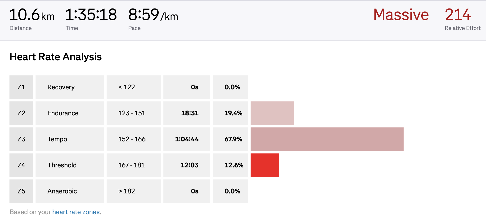

# Kreuzberger Viertelmarathon
> 2025/09/07

I ran the Kreuzberger
Viertelmarathon (10.5K) today.
I couldn't stick to my running plan.
A new job came with a new schedule, and I couldn't find time to run during the week.
Once I find a rhythm, I should be able to stick to the plan better.

Still, I hoped to do a lot better.
I participated with my wife and tried to stick to her pace.
This meant I was running very slowly. I should've been running in zone 2.
But I noticed it was between zone 3 and zone 4.

It was easier for me to finish the race at this pace, but it wasn't an "easy" run by any means.
This makes me worry.
My half-marathon is nearing, and I have a lot to catch up on.
n
I finished the Viertelmarathon in 1:35:14 (09:04/km) and was dead last.