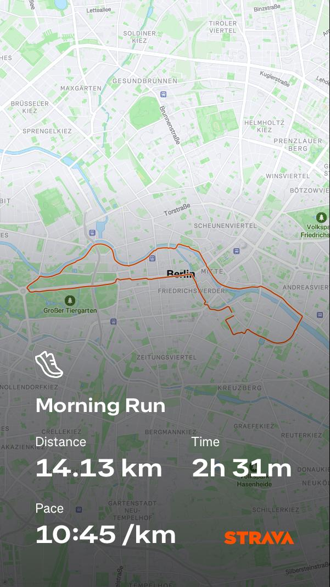

# First 14K Run of my Life
# > 2025/09/24

I couldn't stick to my running plan.
I didn't consistently do my 3 runs per week.
The clock is ticking and the half-marathon is just a month away.
I need to build my endurance. There's no other way around it.
So I decided to do a long run today.
I planned to run 14K at an easy pace. My goal was to finish without walking.
I started very slow. Kept my heart rate in zone 1 and 2.
Even I was surprised because usually, even if I do easy runs, my heart rate goes up to zone 3.
I guess those runs weren't slow enough.
This time I was literally plodding.

It took me 2 and a half hours to finish the run.
So this was officially my longest run ever. Both in distance and time.
I'm quite happy I achieved my goal of not walking.

But as the day progressed, my legs got sorer and sorer.
My knee started hurting and I had to walk as if I had a wooden leg.
took me 2-3 days to recover.