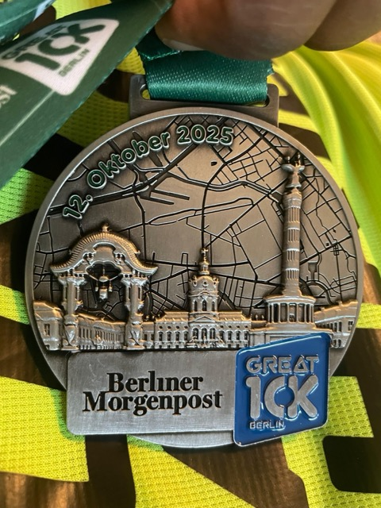

# Another 10K one week before my first half-marathon

> 2025/10/12

Before I tell you about my latest 10k, let's do a quick recap of events before the current week.
- I could not consistently run 3 times per week as planned.
- 2 weeks ago, I tried running a 15k but had to stop at 13k.
- After that, I had to take a week-long break due to a work trip.

That brings us to this week.
On Monday, I joined the Slowpokes Run Club for a 5k run.
They were doing a 7:30 pace, and despite my week-long break, I was confident I could keep up.
I didn't. I had to stop after 2km.
My confidence was shot.

2 days later, I did a rolling 300 run for 5k. 
I did 300m fast and 300m slow, repeating 6 times, sandwiched by 1k easy runs at the start and end.
I managed to complete this with an average pace of 8:01 min/km.

But I was really doubtful about the 10k that was scheduled for the weekend.
I also didn't want to push myself too hard just a week before the half-marathon.

So I decided 2 things:
1. I would run the 10k at a very easy pace, around 8:30 min/km
2. I would test out nutrition for the half-marathon by taking gels during the run.

After I had a hard time running the 15k, I realised that I might need to manage my nutrition.
It was a hot day, and I had not hydrated well.
So I learned about hydration and nutrition during long runs.
Bought the cheapest gels I could find in Decathlon.
I got 2 pre-run gels and 4 during-run gels.
I decided to test out 2 of those during the 10k, and if all goes well, I will take the rest during the half-marathon.
I also got some electrolyte tablets to mix with water.

On the day of the run, I had a light breakfast two hours before the run: some rice and a protein shake.
I also took a pre-run gel 60 minutes before the run.
I mixed an electrolyte tablet in my 250ml water bottle and took small sips every 2kms.

The weather was perfect for running. It was neither cold nor hot, and the rain was like a light, refreshing mist.
I soon realised that I was running faster than I planned.
I wanted to reel it in, but the atmosphere was so good that I couldn't.

I finished the 10k, without stopping, in 01:13:54, with an average pace of 7:20 min/km.
It's not as fast as my fastest 10k or even my first 10k, but it's the fastest since I resumed running this year.
I was very happy with the result.
But I'm also very anxious now about my half-marathon next week.
Maybe I pushed too hard. Maybe I practised too little.
I have no idea how I'll perform or if I'll be able to finish the race.
I guess I'll find out soon enough.