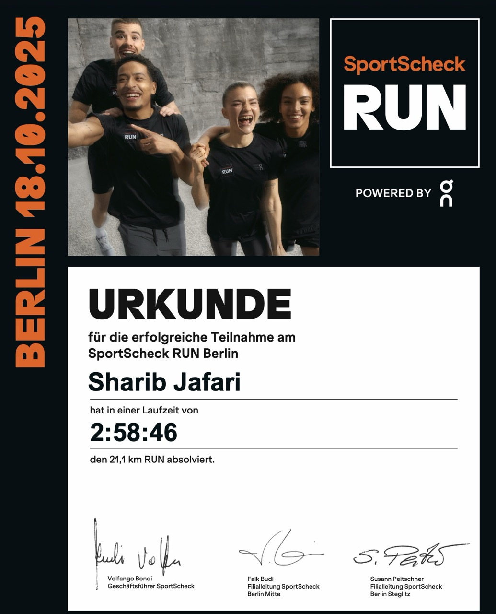

# My First Half-Marathon

> 2025/10/18

What a race!
I was very nervous leading up to it, and not just because of my lack of training.
The track was a 5km loop that I was supposed to run 4 times.
The longest I've run so far is 14k, and the lack of training meant I'll have to go slow if I want to finish the race.
When you are running 21kms, running even a minute per km slower means a 21-minute difference in your finish time.
So there was a high chance I'll be running the last loop alone.
It doesn't feel good to be the last runner in a race.
I had experienced it once during [the breakfast run in Prague](?1_first10k) earlier this year.
It takes a lot of mental strength to keep going when you know everyone else has finished.
Even more so if they all pass you by 4 times as you loop around the track to the finish line.
I hoped against all hope that I wouldn't be the last one this time.

My goal was to pace myself between 8:00 and 8:30 per km.
I also had my gels ready to take every 5km and water to sip every 15 minutes.
But in planning all this, I had forgotten to consider the weather and clothing.

The race was at the Tempelhofer Feld in Berlin, which is a vast open space that used to be an airport.
Since it was an evening in late October, it was dark and cold.
The temperature was around 6 degrees Celsius, and I only had a light jacket on.
As we lined up at the start, I could see my breath in the air.
The music was pumping, and the crowd was cheering.
There were two old, but real, planes parked right next to the start line.
There were lights and fireworks. It was quite a spectacle.
But I was nervous and anxious.

As the race started, I quickly found myself at the tail end of the pack.
We were supposed to first do a short loop of 1km before starting the 5km loops.
I noticed that my legs are locking up already.
Did I put on the socks too tightly, or am I just out of shape?
I tried to ignore it and focus on finishing the small loop.
I realised that even at the end of the pack, my pace was still around 7:30 min/km.
That was faster than I had planned.
I suppose that the stiffness might be a result of lactate build-up due to going faster than my planned pace.
So I walked for a minute until my legs felt better and then stuck to a slower pace.

By then, I was already thrown off a bit, and I was questioning my sanity.
Maybe I shouldn't have enrolled for this without proper training.
Maybe I should first get to a faster pace before attempting a half-marathon.
Maybe I should just quit now, as there is no way I can do four loops when I can barely run 1km without my legs locking up.
But I kept going.

The first loop was the hardest.
Then I found my rhythm.

The second loop was better.
I was able to maintain a steady pace, and there were still runners all around me.
I was a bit worried about the 3rd loop.
I was afraid that, like last time, my body might just give up on me after 13-14kms.
So I forced myself to take a minute or two of walking breaks every 2 km.
I made peace with the fact that I would be the last runner and focused on finishing the race.

The third loop was the easiest.
I was listening to my playlist and just focusing on putting one foot in front of the other.
I even got my second wind and was able to run faster than my planned pace.
Regardless of the walking breaks, I was able to maintain an average pace of 8:20 min/km.

Then came the final loop.
Everyone in front of me had changed lanes to go to the finish line.
I was the only one left on the track.
The crowd was very supportive and cheering me on as I started my last loop.
But as soon as I left the start/finish area, it was quiet and dark.
A part of the loop, soon after the start/finish area, was a long straight stretch.
It was sparsely lit, and I could see some reflective boards marking the bend in the track far ahead in the distance.
Running on that stretch meant I could see far ahead in both directions.
And there I was, all alone.

No one in front of me, no one behind me.
No one to run beside me, and no one to cheer me on.
I knew the organisers must be waiting at the finish line for me to complete, and I still had 5 km to go.
The pressure was unbelievable, but I had resolved to finish no matter what.

I kept going.
2 km into the loop, some volunteers started tailing me on their bikes.
I could hear them conversing, and their headlights made my own shadow dance on the track in front of me.
I felt watched and judged. It's silly, I know, but I couldn't help it.
I kept going. I wasn't taking walking breaks anymore.
Partly because I didn't want the volunteers behind me to see me walking.
Partly because I was afraid that if I stopped now, my legs would lock up again and I wouldn't finish.

Roughly 1.5 km before the finish line, my left leg hit the ground at a weird angle, or maybe my body was simply at its limits, a sharp pain shot in my heel, and I started limping.
Every further step was painful and slowed me down considerably.
Having to stop this close to the finish line would be terrible.
I half limped, half ran, and somehow continued.
After a few hundred meters, I found an angle that didn't hurt as much.
So I focused on putting my left foot down in that precise angle and picked up the pace again.

Finally, I saw the finish line.
The water station was already packed up, and only a handful of people remained near the finish line.
They were all cheering for me.
I was the last runner.
I crossed the finish line in 02:58:46.
Collected my well-deserved medal and, somehow, didn't collapse.

The rest of the night was difficult. I caught a cold, and my feet were hurting.
I was sore for the next 2 days.
But I had done it.
I had finished my first half-marathon.
