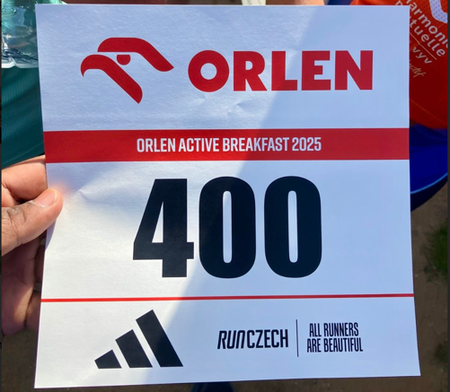
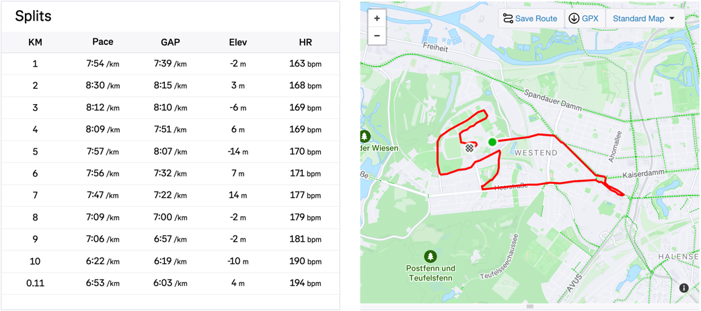
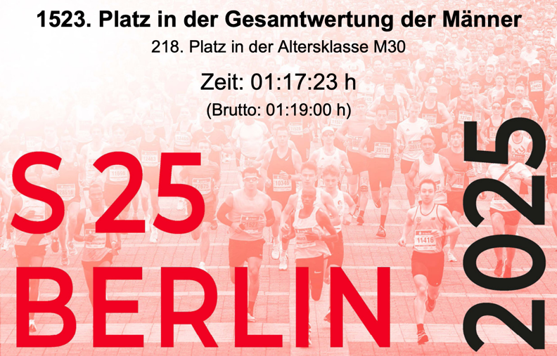

# First 10K (Post Injury)
> 2025/05/11

## Motivation
Late last year, I finally started working on my fitness again and decided that I would learn to manage my injuries and get back to running.

I registered for a 10k at the beginning of this year, even though I couldn't run a 5k at the time.
I had started running, though. I was using a simple app to suggest intervals and track progress.
I started in late December with 6 minutes of total running (6 x 1 minute running and 1 minute walking).
At the time of 10k registration, I had completed 16 minutes of running (2-minute intervals) and a distance of 2 km.

For pain management, I focused on stretching and using a thickly cushioned shoe with knee and ankle support.

I registered for "S25 Berlin" because it held a sentimental value for me. This was my very first 10k in 2022.
I remember it being very hard, but I completed it without walking and at 1:05:09.
The race ended in the Olympic Stadium.
I could never forget the last few hundred meters when you leave the road and go through a tunnel to suddenly emerge inside a stadium full of people cheering.
It felt amazing and took away all the pain.

This year, I was determined to do better. I wanted to complete the 10k within 1 hour.
Sadly, I couldn't.

## Preparation
I had resolved to run thrice a week and gradually increase my distance.
However, after a few weeks, I found it difficult to do three runs. Something or the other would come up, and there would be weeks when I had not run at all.
Even when I ran, my pace was very slow. I ran a 5k in mid-February, and although I completed it, I couldn't run continuously and was among the last people to finish the race.

Still, by April, I was able to run continuously for up to 17 minutes at an average pace of 8:30.

I had 2 weeks of vacation right before the race. I was backpacking in Spain.
I did two runs in the first 3 days of vacation, the longest being 6k continuous.
It was very hard, and I recall muttering encouraging words to myself after the 5km mark to keep going.
It took me almost an hour to finish the 6k, but I was happy to have done it.
I was sure that if I kept increasing my distance, I could do the 10k on race day.
But the very next day, I fell off a mountain bike and got injured.
I got a nasty road rash on my right hip, and a big area around it fell numb.
Forget running, I couldn't even walk properly for a few days.

I continued my vacation, and on the very last day (a week before the race day), I joined a breakfast run in Prague.
It was a day before the Prague marathon. A fun-run sort of event with only 4kms. I was certain that I would finish the race; the only question was how soon.
But when I started running, my feet felt heavy. I later learned about lactate build-up, but I didn't know about it then.
I was too slow for everyone else, and being left behind took a toll on my morale.
The trousers were rubbing against my road rash, and I was in pain. I had to hold my pants away from my hip to avoid the friction.
At one point, I got confused and took a wrong turn, cutting the distance short by 1km.
It felt like a failure, and I was disappointed.

In the next few days, I actually learned a little about pacing, different kinds of runs, and lactate build-up as my absolute failure in Prague made me curious.
It did little to help my confidence, though.

By now, I was certain I would not be able to finish the 10k within 1 hour.
I had serious doubts about completing it without walking or completing it at all.

## Pre-Race
I couldn't sleep well and was up by 4 am. The race was at 9:30.
I had a protein shake for breakfast and left home around 8.
I was nervous and lacked confidence.

My goal was now to simply finish the 10k.

I put cotton pads on my road rash to avoid friction and bandaged it so it doesn't move around.
I wore light clothes and used my cushioned shoes.

My pacing strategy was to stay within Heart Rate Zone 3 for the first 3-4km, go up to Zone 4 till the 7km mark, and push it to Zone 5 for the next 2km before dialling it down for the last km.
I tried to memorise the route and went through the strategy in my head a few times.

At the venue, I did a warm-up run and some stretches. I also did a light jog for 3 mins, but even that felt tiring and made me nervous.

There was no going back. I was at the start line at 9:25, trying to stay as far back in the crowd as possible.

## Race
As the race started, I focused on my breathing and tried to keep my heart rate in Zone 3.
It didn't work. I was already in Zone 4. If I tried to bring it down further, I would almost be walking.
But I felt comfortable, so I kept going. Whenever I noticed my heart rate going up, I would slow down a little.
I found a girl running at a similar pace and decided to stick with her. She was doing the half-marathon, but our pace matched.
I think my pace was somewhere between 8:00 and 8:30.
I felt a little low around the 3km mark, but I kept going.
My family was there to cheer for me, so that helped.

My original plan was to speed up after 3, but I didn't dare. I decided to stick to the current pace till 5km.
Around 4, I started feeling good. I didn't speed up, but I didn't have to stop running, and I wasn't feeling as tired as I recalled myself feeling on my very first 10k, 3 years ago.
Around 7km, I sped up. I was smiling as I was running because now I knew, whatever happens, I'll finish the 10k.
That too, without walking. I was very proud of myself.

Finally came the last km. I was tired, but I pushed myself to go faster. Once I reached the stadium, I was ecstatic.
I had done it. A lot slower than I had originally planned, but I had done it nonetheless.
I crossed the finish line and collected my medal.
My time was 1:17:23.

## Post Race
I neglected to do the cooldown stretches. I was too tired and too hungry.
I reached home, ate a little, and slept.
As the day progressed, I started feeling the pain in my legs.
My left knee was hurting, and my legs felt stiff.
I had to wear a knee brace the next day, but the pain was gone in 2 days.

## Conclusion
Nothing went as planned, but I am happy with the result.
Now I know the importance of pacing and the different kinds of runs.
I plan to integrate this knowledge into my training and keep working towards my end goal.
I've a 5k in June (company fun run) and I plan to keep training until I feel comfortable registering for a half-marathon.
I'll work on improving my pace and endurance.
Let's see how it goes.