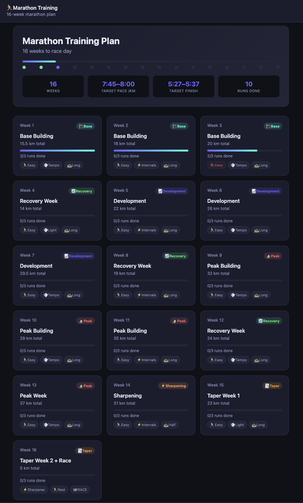

# Marathon Running Plan

> 2026/06/05

I like the Runna app a lot but it's too expensive.
The free version gives a high level overview of the preparation runs needed for a particular race but doesn't give the exact details of each run, nor does it readjust the plan based on actual runs.
Even for the functionality provided, 20 euros a month for Runna feels a bit excessive.

Luckily I'm a dev.
I created an n8n workflow to scrape running data from my Strava account and feed it to an AI agent, together with the running plan from Runna, to generate a detailed plan.

The agent has access to my previous runs and my running calendar so it can dynamically adjust the plan.
I also created a simple html page to visually track my plan.
I'm not tying the plan to a particular date on purpose to keep some room for error (sickness, work etc)

Here's the current snapshot of the plan but it can change as I progress:

