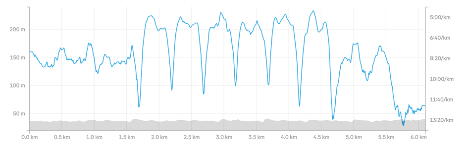

# First (Proper) Interval Run
> 2025/05/14

I'm training for my 5k, which is in 3 weeks.

My goal is to run it in under 30 minutes.

I used the Runnna app to get a training plan. I've committed to 3 runs per week, but this time I want to do different kinds of runs.

My very first run was an interval run. I had done run-walk-repeat before, but I didn't know that an interval run is supposed to be high pace and intensity. This time, I intended to do a proper interval run.

The app asked for a 1.6km easy run, 6x 400m fast + 60s walking, and a 1.4km slow run.

I did the easy run at an average 8:15 pace and the intervals at an average 6:00 pace. I ran as fast as 5:30, which I hadn't done before unless I was sprinting.

Only in the end, I couldn't do the continuous slow run and had to walk the last 500m.

I was spent.

> P.S. This run made me a local legend on Strava. I'm not sure what to do with this make-believe crown.
