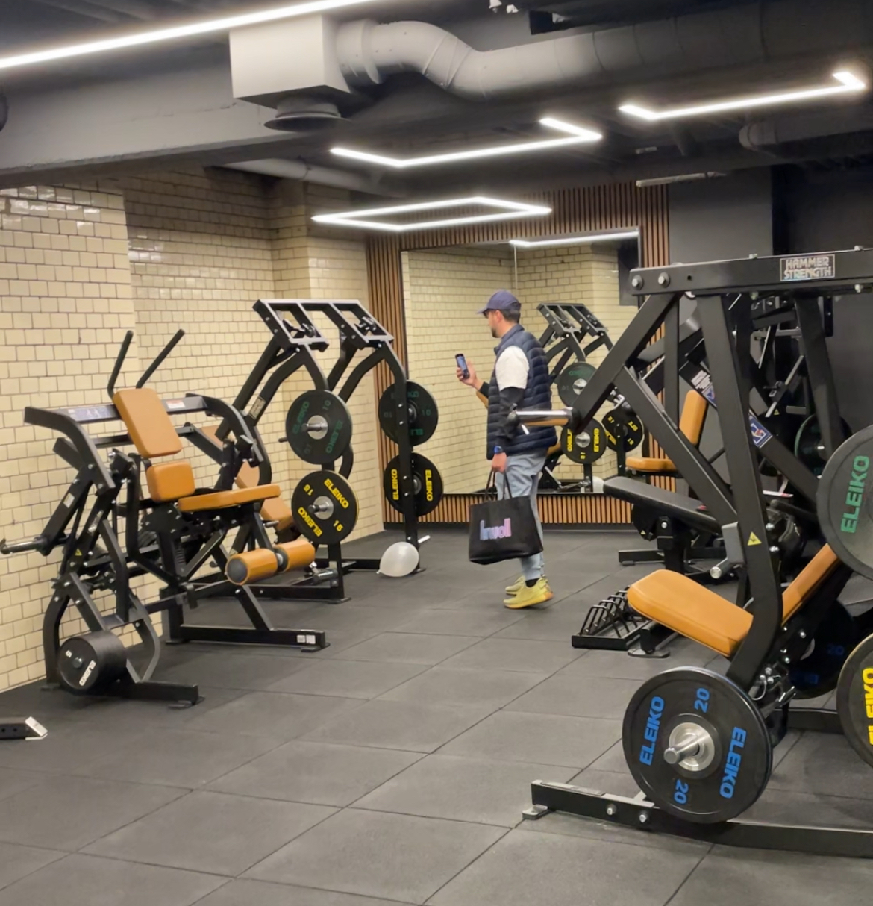

# My first GYM Membership
> 2025/05/15

I do home workouts. I have a couple of dumbbells, one kettlebell, and recently, I even bought a foldable bench.

But I've never been to a gym. As I write this, I vaguely recall registering at a gym long ago. Even then, I went only a few times, had no idea what to do there, and eventually stopped.

Why did I get a membership now? Mainly because it was free. I'm happy with my home-workouts and don't have high hopes of this gym membership. I just wanted to try it out.

I get 3 months of free access. I intend to use the treadmills and use what little I've learned about strength training.

Eventually, I would like to build muscles, but for now, my main goal remains to build endurance and stamina. I need to work towards my first triathlon, and I can't even swim yet.

Still, I look forward to trying out the gym. Maybe I'll get to know a few people in my area who share a similar goal.