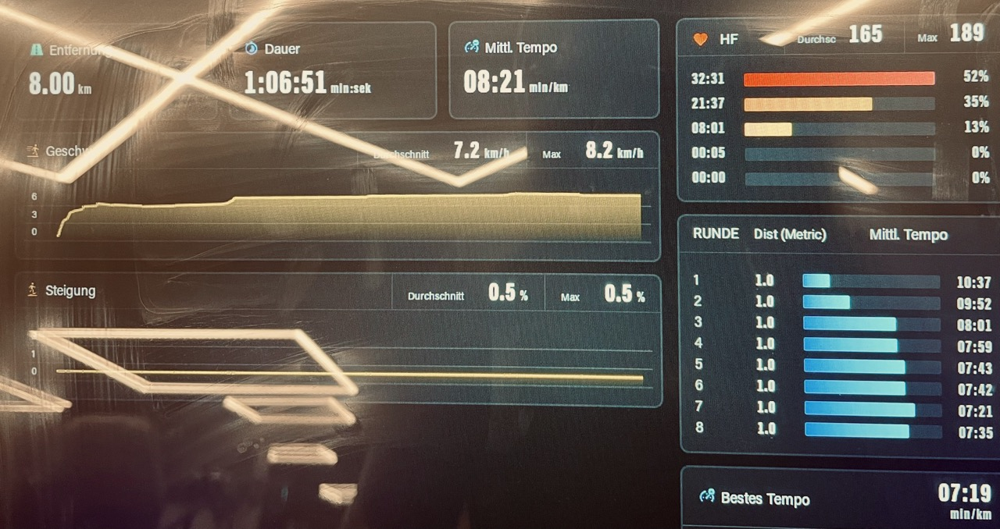

# First Treadmill Run
> 2025/05/17

The app plan had an 8k long run with an increasing pace every 2km.
Since I wanted to try the treadmill, I decided to go to the gym.

Yesterday I did an easy run with my wife to give her company. We completed 3k with 10:18 pace (3min run, 1min walk). I assumed it would be more like a warm-up for me, but I'm not so sure now.

This morning I did a home-workout with my online personal trainer. Leg day. My daughter joined me too, so it was fun, but I went all out. It was also the first time my - soon to be 4 - daughter did a full workout with me.

Needless to say, my legs were sore, and I had to muster all my willpower to get to the gym. I reached there around 8pm as I wanted to put as much buffer between my workout and my run as possible.

Running on a treadmill felt weird at first. I'm so used to running outside that without the visual cue of things passing by, I couldn't judge my pace. Next time I'll try the scenic mode of the treadmill.

Although it was more accurate because I was able to simply program the exact pace I wanted to run at. Starting slow and then increasing the pace is hard because after 4km I was already tired. I had to push myself a lot, especially for the last 1 km. The music helped.

I also did the run in my gym shoes instead of my usual running shoes, but it wasn't a problem. They were comfy enough.

I was exhausted by the end of the run. I did a cooldown walk and some stretches. I was drenched in sweat, but I felt good.

My plan has a 5k easy run tomorrow, but I'm not sure if I should do it. My legs are sore and I don't want to overdo it.