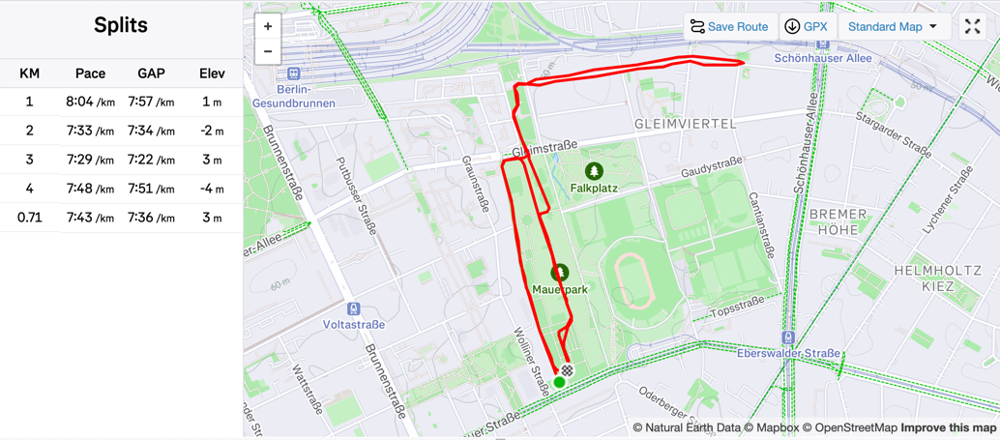

# First Strava Club Run (Slowpokes)
> 2025/05/19

I had posted on Strava that I was looking for someone or some group to run with. The criterion was, of course, that they matched my pace, which at the moment is quite slow (around 8 min/km)

Someone recommended the Slowpokes club. They did almost 5 km every Monday evening at a comfortable (still slightly faster than mine) pace. I decided to join them.

This Monday, I finally went there directly from work. Which meant I was still carrying my laptop bag. I also had 3 cups of coffee and no water for almost the entire day, so I was parched by the time I reached.

It turned out to be a nice run. I was working hard but not too hard, and the trainer was nice and encouraging. She also had us do some warm-up and cooldown stretches, which I had been neglecting.

The group consisted of around 7 people, mostly women. I was the slowest, but I didn't mind. My bag opened up twice during the run, so I had to stop, fix it, and catch up with the group. In the end, I just carried it in front of me and held it with one hand.

I think I can keep going at least until my pace improves considerably. Next week they are doing a 10k, which I'll skip, but the next time they do a short run, I'll join them again.

I also explored some other clubs in the area, but for most of them, I need a considerably faster pace. I think I'll stick with Slowpokes for now.