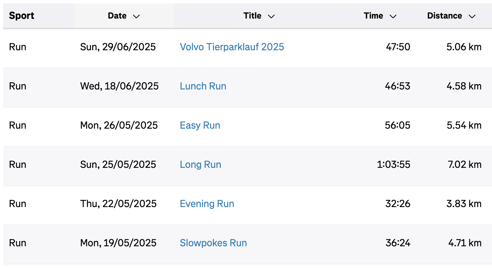

# Fell off the wagon
> 2025/06/29

I officially fell off the wagon.

It started with stuff that seemed urgent and important.

I was approached with a job opportunity that I wanted to pursue so I took some time off to prepare for the interviews. Then I took some more time off thinking I've earned it since I worked hard to clear the interviews and get a new job.

Then I took some more time off without realising it because I was busy doing paperwork, negotiating my contract, resigning, negotiating my notice period etc. etc.
Then I HAD to take some more time off because I fell sick. I still am. I can barely talk and my head and throat hurt.

Needless to say, the time without running kept expanding and I always had a couple of excuses not to go for a run.

As I started to write this, I looked at my Strava activities.

I spent a month without running except for just one easy run one afternoon. 4 to 5 weeks without running. That's 12 to 15 runs that might've helped me level up.

Anyway, time to get back on that horse/wagon.