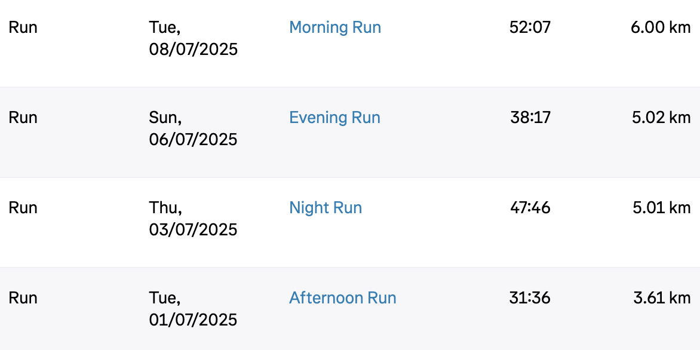

# Rest Continues
> 2025/07/29

Another month went by without much running.

I did some runs in the first week and did sufficient strength training at home during the 2nd week.
A friend stayed with me for the last 2 weeks of the month so I was busy showing her around and didn't work out at all.

I need to find a rhythm.
With two more weeks of vacation coming up soon, it will be even more difficult to make time for running.
Maybe the pressure of the upcoming half-marathon will help.

My plan was also to start swimming classes by now but that didn't happen either. I couldn't even capitalise on good weather and use the sommerbad (open pubic swimng pool) to practice.
Need to sort that out too.

I cancelled my gym membership as I was hardly utilising it.
Home workouts and outdoor running work better for me.
I do have a month left, so maybe I'll do some speed work on a treadmill.

Hopefully, the next post will be about some nice runs or swims.